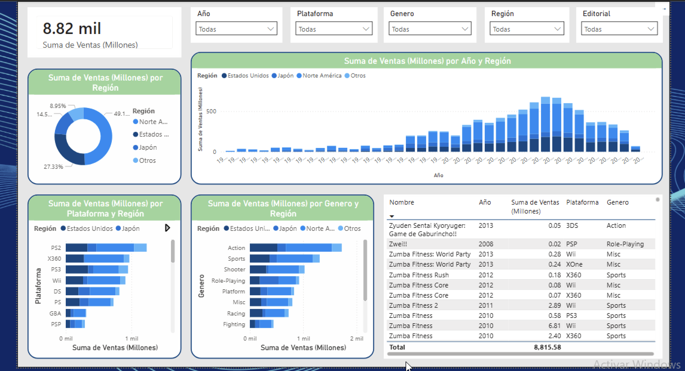

# ANALISIS VIDEOJUEGOS

Este reporte de ventas históricas de videojuegos (1980-2017) muestra un volumen total de 8,820 millones de unidades vendidas. Norteamérica es el mercado dominante con el 49.15% de las ventas, seguida por Estados Unidos y Japón. El éxito alcanzó su pico entre 2008 y 2009, destacando el género de Acción y la plataforma PS2 como los líderes históricos.

