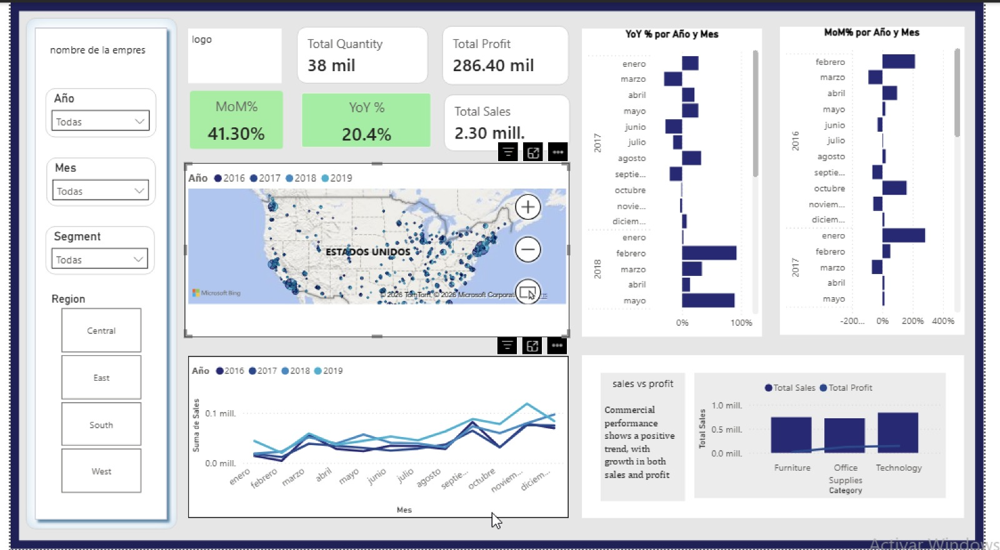
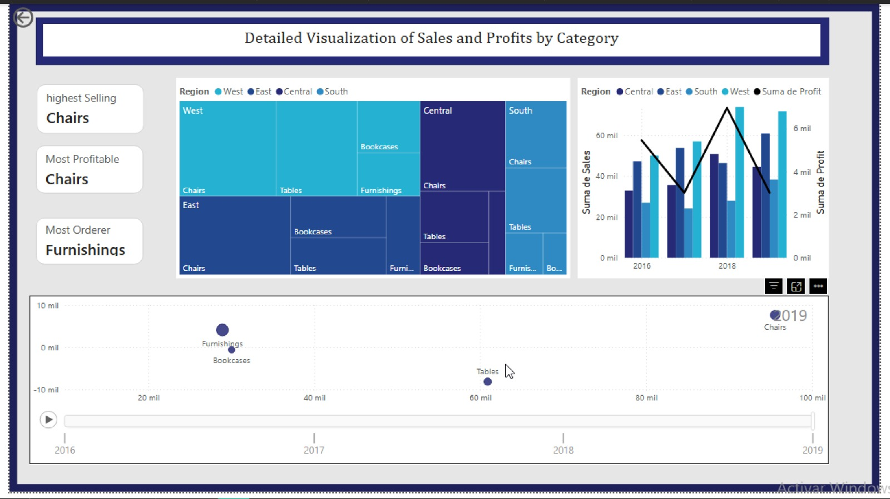
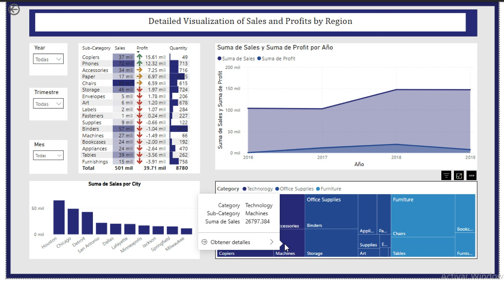

# SALES ELECTRONICS

## FIRST PICTURE

**This dashboard shows the company's sales performance across different regions and time periods. The map displays where sales are generated in the United States, with larger points representing higher sales. The line chart shows monthly sales trends from 2016 to 2019, helping identify growth patterns over time. The YoY and MoM charts present the percentage change in sales compared to the previous year and previous month. The bar and line chart compares total sales and profit by product category, showing that Technology has the highest sales and profit. The KPI cards summarize key business metrics such as total sales, total profit, total quantity sold, and growth rates.**
.

## SECOND PICTURE

**This dashboard analyzes sales and profit by product category and region. The treemap shows the sales distribution of categories such as Chairs, Tables, Bookcases, and Furnishings across different regions. The combo chart compares total sales by region and year, while the line represents profit trends over time. The KPI cards highlight the highest-selling product, the most profitable product, and the most ordered product. The scatter chart displays the relationship between sales and profit for each category from 2016 to 2019, helping identify which categories generate high sales and higher profitability. Overall, the dashboard helps compare category performance and identify the most valuable products for the business.**

## THIRD PICTURE

**This dashboard analyzes sales performance by region, city, and product category. The KPI cards show total sales, total profit, total quantity sold, and average sales. The bar chart compares sales and profit across different product sub-categories, helping identify the best-performing products. The line chart displays sales trends from 2016 to 2019, showing how sales changed over time. The city ranking highlights the top cities with the highest sales. The treemap shows the contribution of each product category to total sales. Overall, the dashboard helps users understand regional performance and identify key sales opportunities.**
 
